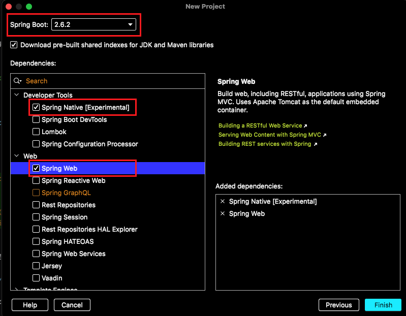

# Spring Native Tutorial
DTD2022 #1 에서 발표한 Spring Native 샘플 코드입니다. 해당 내용은 Mac OS 환경 기반입니다.  

## 1.Spring boot project  생성
인텔리J 의 Spring initializer 에서 Spring-Native 와 Spring-Web 을 선택해서 프로젝트를 생성한다.


## 2.GraalVM 설치

### 2.1 GraalVM Download 
- 공식 홈페이지 [GraalVM](https://www.graalvm.org/downloads/) 에서 환경에 받는 GraalVM Download 한다.
- 다운로드 받은 파일의 압축을 해체 후 /Library/Java/JavaVirtualMachines 경로로 이동
  ```shell
  sudo mv ./graalvm-ce-java11-21.3.0 /Library/Java/JavaVirtualMachines
  ```
### ~~2.2 homebrew(cask) 를 통한 GraalVM 설치~~
- ~~homebrew 설치 안 됐을 경우 아래 홈페이지 참고~~
    > https://brew.sh/index_ko
- ~~cask 설치 안 됐을 경우 아래 명령어 실행 (cask 는 GUI 기반 애플리케이션을 추가로 설치 가능하게 함)~~
    > brew install cask 
- ~~Graal VM 설치~~
    > brew install --cask graalvm/tap/graalvm-ce

### 2.3 환경변수 등록
```shell 
export GRAALVM_HOME=/Library/Java/JavaVirtualMachines/graalvm-ce-java11-21.3.0/Contents/Home
```

### 2.4 설치 확인
```shell
/Library/Java/JavaVirtualMachines/graalvm-ce-java11-21.3.0/Contents/Home/bin/java -version
---
openjdk version "11.0.13" 2021-10-19
OpenJDK Runtime Environment GraalVM CE 21.3.0 (build 11.0.13+7-jvmci-21.3-b05)
OpenJDK 64-Bit Server VM GraalVM CE 21.3.0 (build 11.0.13+7-jvmci-21.3-b05, mixed mode, sharing)
```

(단 실행할 때 Mac OS 에서 실행 중 오류 팝업이 나타나면 아래와 같은 명령어를 입력해본다.)
```
sudo xattr -r -d com.apple.quarantine /Library/Java/JavaVirtualMachines/<graalvm 설치경로>
ex)sudo xattr -r -d com.apple.quarantine /Library/Java/JavaVirtualMachines/graalvm-ce-java11-21.3.0
```

## 3. Build 
```shell
 ./mvnw -DskipTests=true -Pnative clean package
```
## 4. Execution
약간의 시간이 지난 빌드가 완료된 후 target 디렉토리로 이동하면 실행파일이 한 개 만들어져 있다. 해당 파일을 실행해보자
```shell
cd ./target
./spring-native-tutorial
```